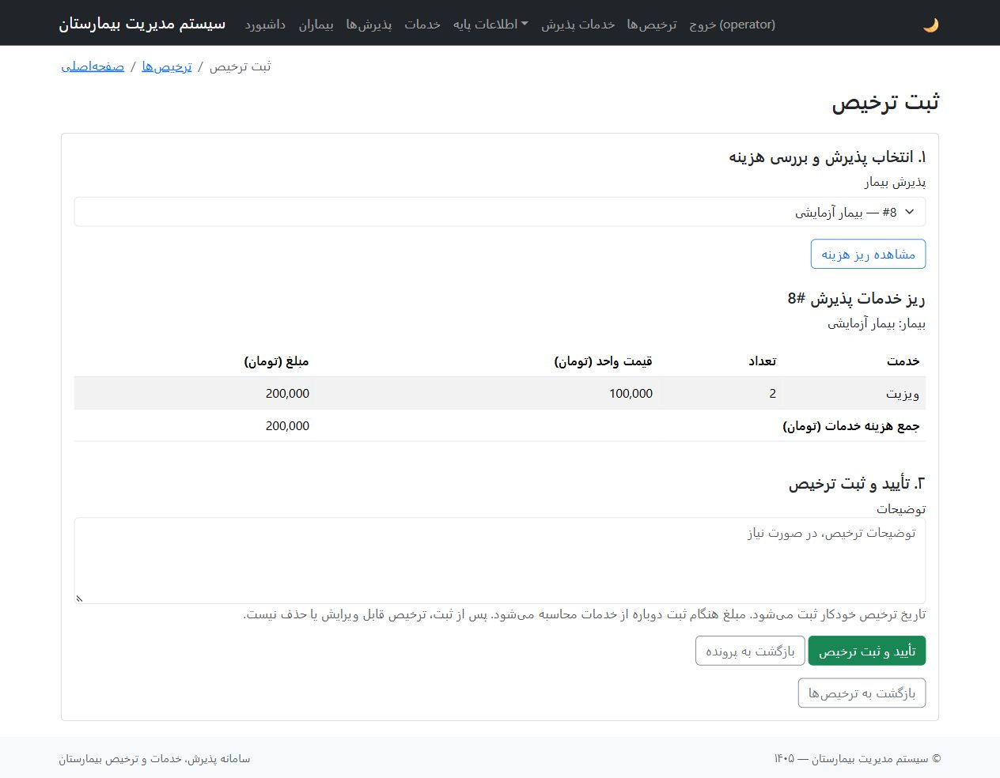

# گزارشکار اصلاح سامانه پذیرش، خدمات و ترخیص بیمارستان

تاریخ انجام: ۱۳ مهر ۱۴۰۵ / ۵ اکتبر ۲۰۲۶

## هدف و مبنای کار

هدف، تطبیق نسخهٔ موجود با صورت پروژهٔ «سامانه ساده پذیرش، ارائه خدمت و ترخیص بیمارستان» و اصلاح اختلاف‌های شناسایی‌شده بود. چهار صفحهٔ فایل final project.pdf، مدل‌ها، کنترلرها، فرم‌ها، SQL نصب و راهنمای اجرا بررسی شدند.

قابلیت‌های اصلی در نسخهٔ اولیه وجود داشتند، اما مسیر انتخاب بیمار تا ترخیص به فرم‌های عمومی وابسته بود. انتخاب پزشک و بخش به داده‌های از قبل تعریف‌شده نیاز داشت، پیش‌نمایش مبلغ در فرم ترخیص وجود نداشت و فایل‌ها و آزمون‌هایی از قالب اولیه باقی مانده بودند.

## تغییرات انجام‌شده

### ۱. اتصال فهرست و صفحهٔ بیمار به پذیرش

در هر ردیف فهرست بیماران دکمهٔ «ثبت پذیرش» اضافه شد. در صفحهٔ اطلاعات بیمار نیز «ثبت پذیرش برای این بیمار» در دسترس است. شناسهٔ بیمار به کنترلر منتقل می‌شود و بیمار در فرم پذیرش از قبل انتخاب شده است. شناسهٔ نامعتبر یا بیمار ناموجود با پاسخ 404 رد می‌شود.

فایل‌های اصلی: app/controllers/AdmissionController.php، app/views/patient/index.php و app/views/patient/view.php.

### ۲. اتصال پذیرش، خدمات و خلاصهٔ پرونده

صفحهٔ پذیرش بستری و خلاصهٔ پرونده اکنون دکمه‌های «افزودن خدمت» و «مشاهده هزینه و ترخیص» دارند. در فرم خدمت، پذیرش مربوط از قبل انتخاب شده است. پس از ثبت خدمت، کاربر به خلاصهٔ همان پرونده بازمی‌گردد و می‌تواند خدمت دیگری اضافه کند یا هزینه را برای ترخیص بررسی کند.

این دکمه‌ها برای پروندهٔ ترخیص‌شده نمایش داده نمی‌شوند. مسیر مستقیم افزودن خدمت برای پذیرش بسته نیز در سرور رد می‌شود؛ کنترل‌های قبلی ثبت، ویرایش و حذف خدمات پس از ترخیص حفظ شدند.

فایل‌های اصلی: app/controllers/AdmissionServiceController.php، app/views/admission/view.php و app/views/admission/summary.php.

### ۳. پیش‌نمایش هزینه و تأیید ترخیص

فرم ترخیص به دو مرحله تقسیم شد:

1. انتخاب پذیرش و نمایش ریز خدمات، تعداد، قیمت واحد تاریخی، مبلغ هر ردیف و جمع هزینه به تومان.
2. ثبت توضیحات و تأیید ترخیص برای پذیرش انتخاب‌شده.

ورود از داخل پرونده، پیش‌نمایش را مستقیم برای همان پذیرش باز می‌کند. ورود از فرم عمومی، امکان انتخاب پذیرش و مشاهدهٔ هزینه را می‌دهد. پس از ثبت، خلاصهٔ پرونده همراه با وضعیت و مبلغ نهایی نمایش داده می‌شود.

مبلغ نهایی و تاریخ ترخیص از ورودی کاربر دریافت نمی‌شوند. سرور هنگام ذخیره مبلغ را دوباره محاسبه می‌کند. بنابراین، اگر خدمات بین پیش‌نمایش و ثبت تغییر کرده باشند، مقدار نهایی بر اساس خدمات موجود در لحظهٔ ثبت تعیین می‌شود.

فایل‌های اصلی: app/controllers/DischargeController.php و app/views/discharge/_form.php.

### ۴. روشن‌شدن پیش‌نیازهای پزشک و بخش

منوی «اطلاعات پایه» با دسترسی به پزشکان و بخش‌ها اضافه شد. وقتی پزشک یا بخش وجود ندارد، فرم پذیرش پیام مشخص و لینک تعریف اطلاعات پایه نشان می‌دهد و دکمهٔ ثبت غیرفعال می‌شود.

نام‌ها، عنوان‌ها و دکمه‌های صفحات پزشک و بخش فارسی شدند. تاریخ ثبت از فرم‌های دستی آن‌ها حذف شد و مقدار آن از پایگاه داده تعیین می‌شود. اعتبارسنجی ظرفیت بخش نیز مقدار منفی را رد می‌کند.

راهنما اکنون تصریح می‌کند که وجود حداقل یک پزشک و یک بخش ضروری است؛ تعریف دستی یا واردکردن یک‌بارهٔ دادهٔ نمونه دو روش آماده‌سازی هستند. حداقل یک خدمت فعال نیز برای ثبت خدمت لازم است.

### ۵. اصلاح خطای تاریخ پذیرش

آزمون کامل نشان داد فراخوانی loadDefaultValues در ساخت پذیرش، مقدار پیش‌فرض SQL یعنی CURRENT_TIMESTAMP را به‌صورت متن وارد مدل و فرم می‌کرد. اعتبارسنجی تاریخ آن را رد می‌کرد و پذیرش با تاریخ خالی ثبت نمی‌شد.

این فراخوانی از مسیر ساخت پذیرش حذف شد. وضعیت اولیه صریحاً «بستری» تعیین می‌شود و منطق موجود مدل، تاریخ خالی را هنگام ذخیره به زمان فعلی تبدیل می‌کند. ثبت با تاریخ خودکار در آزمون کاربردی، آزمون HTTP و مرورگر واقعی موفق بود.

### ۶. مرتب‌سازی فایل‌ها و کد باقی‌مانده

۱۸ فایل اشتباه‌جای‌گذاری‌شده در app/web/app از ریشهٔ وب خارج شدند. برای حفظ نسخهٔ قبلی، فایل‌ها به output/backups/misplaced-web-app منتقل شدند؛ این پوشه در Git نادیده گرفته می‌شود.

AccessRule سفارشی بلااستفاده، متدهای بلااستفادهٔ isAdmin و hasRole، مدل ContactForm و مسیر CAPTCHA باقی‌مانده از قالب حذف شدند. آزمون‌های صفحات حذف‌شدهٔ Contact و About کنار گذاشته شدند. آزمون‌های ورود و خروج با رابط فارسی و حساب آزمایشی مستقل بازنویسی شدند.

ستون users.role برای سازگاری با دیتابیس موجود باقی ماند؛ کنترلرهای عملیاتی همچنان همهٔ کاربران واردشده را یکسان می‌پذیرند. وابستگی‌های استاندارد Yii و امکانات مفید موجود حفظ شدند.

### ۷. راهنما و آماده‌سازی تحویل

README از توضیح یک بستهٔ اصلاحی به راهنمای نسخهٔ کامل تغییر کرد. گردش کار، اطلاعات پایهٔ ضروری، نصب تازه، اتصال، ساخت حساب، اجرای Nginx، رفع خطا و اجرای آزمون‌ها توضیح داده شده‌اند.

SQLهای قدیمی با توضیح LEGACY مشخص شدند؛ نصب تازه فقط با database/install.sql انجام می‌شود. ساختار دیتابیس برای این اصلاحات تغییر نکرد و migration لازم نیست.

اسکریپت اجرای Nginx، فرایند پس‌زمینه را با WindowStyle Hidden اجرا می‌کند. چک‌لیست تحویل به دو بخش «موارد آزموده‌شده» و «بررسی روی سیستم مقصد» تقسیم شد.

## تصمیم دربارهٔ امکانات اضافه

| مورد | تصمیم و دلیل |
|---|---|
| جدول‌های users، doctors و wards و شناسه‌های پزشک و بخش | حفظ شدند؛ جدول‌های PDF پیشنهادی‌اند و ساختار موجود کار می‌کند. |
| مدیریت پزشک، بخش و تعرفه | حفظ و دسترسی آن‌ها روشن شد؛ برای آماده‌سازی اطلاعات پایه مفیدند. |
| تقویم شمسی، حالت تاریک و جست‌وجوهای بیشتر | حفظ شدند؛ مانع اجرای سناریوی ساده نیستند. |
| جلوگیری از ترخیص تکراری و تغییر پروندهٔ بسته | حفظ و آزموده شد؛ از ناسازگاری هزینه و وضعیت جلوگیری می‌کند. |
| یک پذیرش فعال برای هر بیمار | اجباری نشد؛ صورت پروژه این ساده‌سازی را اختیاری معرفی کرده است. |
| اجبار داشتن خدمت پیش از ترخیص | اضافه نشد؛ صورت پروژه امکان ثبت حداقل یک خدمت را می‌خواهد و الزام به داشتن خدمت برای هر ترخیص را تعیین نکرده است. |

## محیط و روش آزمون

برای بررسی رفتار واقعی، MariaDB موقت روی 127.0.0.1:3307 با دیتابیس hospital_workflow_test راه‌اندازی شد. SQL نصب کامل روی دیتابیس خالی وارد شد. PHP FastCGI آزمایشی روی 9001 و Nginx آزمایشی روی 8081 اجرا شدند. اتصال و اطلاعات دیتابیس فعلی برنامه تغییر نکردند.

نسخه‌های بررسی‌شده: PHP 8.2.12، Yii 2.0.55، MariaDB 10.4.32 و Nginx 1.31.6.

تنظیم آزمون، فایل اتصال اصلی را نمی‌خواند. نام دیتابیس آزمون باید با hospital_ شروع و با test تمام شود؛ تلاش برای استفاده از نام hospital در تنظیم آزمون رد شد. scripts/Prepare-TestDatabase.php فقط SQL را در دیتابیس آزمایشی خالی وارد می‌کند. دادهٔ fixture پیش از هر آزمون در همان دیتابیس بازسازی می‌شود.

## نتایج بررسی نهایی

| بررسی | نتیجه |
|---|---|
| آزمون‌های واحد: ورود، هویت، رمز هش‌شده و نمایش پیام‌ها | ۲۰ آزمون، ۱۰۳ assertion، موفق |
| آزمون‌های کاربردی: گردش کامل، جست‌وجو، قیمت تاریخی، ترخیص، وضعیت و دسترسی | ۱۰ آزمون، ۵۴ assertion، موفق |
| آزمون‌های HTTP از طریق Nginx: داشبورد، ورود، اطلاعات پایه و گردش پذیرش تا ترخیص | ۳ آزمون، ۱۸ assertion، موفق |
| مجموع اجرای نهایی Codeception | ۳۳ آزمون، ۱۷۵ assertion، بدون شکست |
| بررسی نحوی PHP | ۱۱۳ فایل بررسی شد؛ بدون خطای نحوی |
| تنظیم Nginx تحویل | در ساختار مشابه نصب، همراه mime.types و fastcgi_params اعتبارسنجی شد؛ موفق |
| اسکریپت Start-Hospital.ps1 | بررسی نحوی PowerShell موفق |
| مرورگر واقعی | بیمار خودکار انتخاب شد، پذیرش و خدمت ثبت شدند و پیش‌نمایش هزینه خوانا بود. |
| خطاهای JavaScript در مرورگر | خطا یا هشدار در ثبت مرورگر مشاهده نشد. |
| بررسی فاصله‌ها در diff | git diff --check بدون ایراد |

سناریوی قیمت تاریخی، خدمت با قیمت واحد ۱۰۰٬۰۰۰ تومان را ثبت کرد، تعرفه را به ۹۰۰٬۰۰۰ تومان تغییر داد و تعداد قبلی را به ۳ رساند. قیمت تاریخی ثابت ماند و مبلغ ترخیص ۳۰۰٬۰۰۰ تومان محاسبه شد. مبلغ و تاریخ جعلی ارسالی در فرم نیز نادیده گرفته شدند.

در سناریوی مرورگر، دو واحد ویزیت با قیمت واحد ۱۰۰٬۰۰۰ تومان ثبت و جمع ۲۰۰٬۰۰۰ تومان پیش از ترخیص نمایش داده شد. تصویر این صفحه کنار گزارش ذخیره شده است:

## محدودهٔ تأیید و تحویل

تأیید فوق مربوط به محیط محلی آزمایشی جداست. اتصال دیتابیس اصلی هنگام شروع کار در دسترس نبود؛ اجرای نسخهٔ اصلی روی 8080 و اطلاعات واقعی آن به‌عنوان آزمون انجام‌شده گزارش نمی‌شود. سرویس‌های موقت آزمایش پس از اتمام بررسی بسته شدند.

آزمون فشار، درخواست‌های هم‌زمان، تمام حالت‌های تقویم شمسی و اندازه‌های موبایل انجام نشده‌اند. ساخت حساب اولیه و اجرای اسکریپت راه‌اندازی روی سیستم مقصد باید مطابق چک‌لیست تحویل بررسی شوند.

برای استفاده از نسخهٔ اصلاح‌شده، MySQL و سرویس‌های اصلی را روشن کنید. اگر دیتابیس فعلی آماده است، SQL نصب را دوباره اجرا نکنید. راهنمای اجرا در README.md و موارد بررسی مقصد در DELIVERY_CHECKLIST.md قرار دارند.
